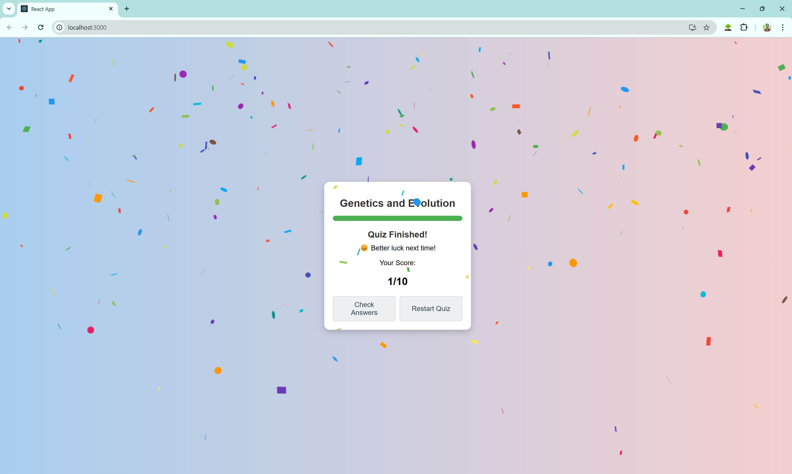
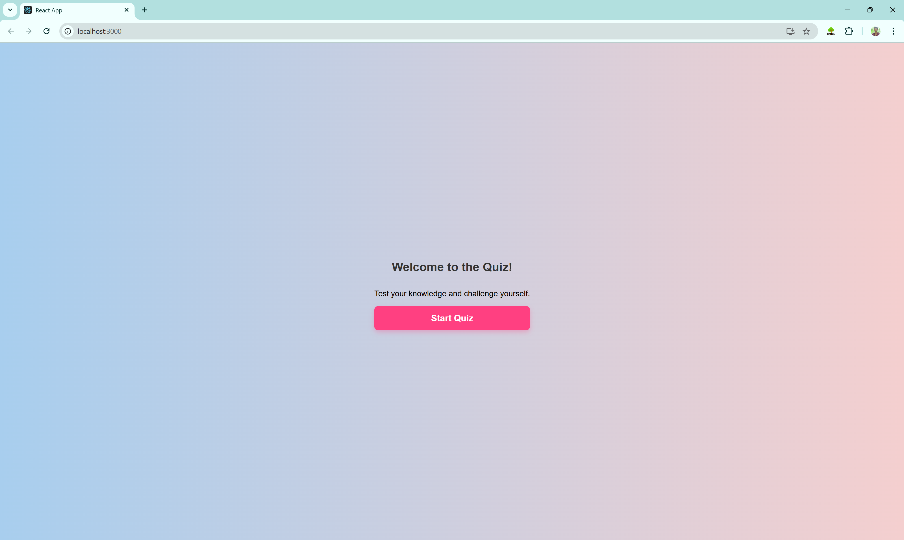
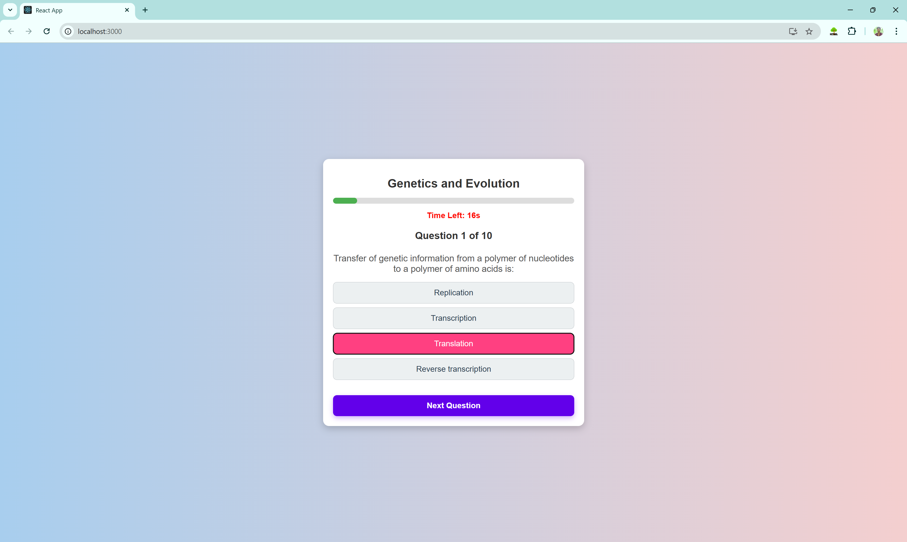

# Quiz App

## 📌 Project Overview
The **Quiz App** is an interactive web application that fetches quiz questions from an API and presents them in a gamified format. Users can answer multiple-choice questions, view their scores, and experience sound effects for correct and incorrect answers.

## 🚀 Features
- 🏆 **Multiple-choice questions** fetched dynamically from an API.
- 🎯 **Score tracking** at the end of the quiz.
- 🔊 **Sound effects** for right and wrong answers.
- ⏭ **Next question navigation** with real-time feedback.
- 🎨 **Responsive UI** for an engaging experience.
- 🎮 **Gamification elements** to make learning fun.

## 🛠️ Setup Instructions
### Prerequisites
Ensure you have the following installed:
- [Node.js](https://nodejs.org/) (Latest LTS version recommended)
- Git (optional, for cloning the repository)

### 🔧 Installation Steps
1. **Clone the repository:**  
   ```sh
   git clone https://github.com/BanavathSrikanth/quiz-app.git
   cd quiz-app
   ```
2. **Install dependencies:**  
   ```sh
   npm install  # or yarn install
   ```
3. **Run the app:**  
   ```sh
   npm start  # or yarn start
   ```
4. Open your browser and visit:  
   ```
   http://localhost:3000
   ```

## 📸 Screenshots & Video Walkthrough
### UI Preview:
  

<div>
  
  
  
</div>

### 🎥 Demo Video:


## 👨‍💻 Developer
**[Banavath Srikanth](https://github.com/BanavathSrikanth)**

-------
